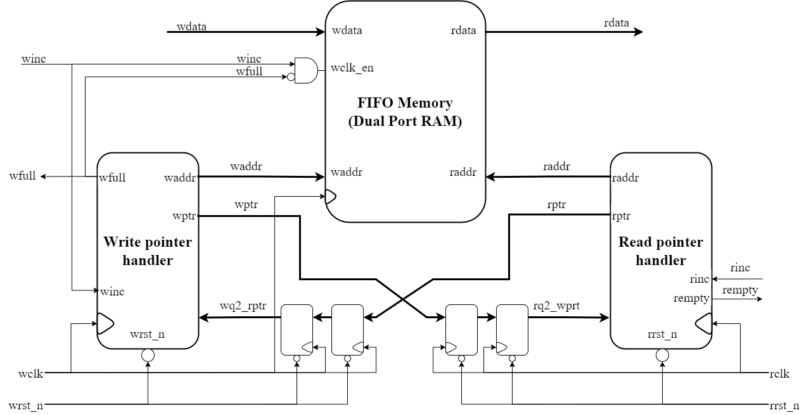

# Asynchronous FIFO Design: A Robust Data Transfer Solution

This repository contains the Verilog implementation of an **Asynchronous FIFO (First-In-First-Out)** buffer. The design is optimized for transferring data between two clock domains safely and efficiently. It is a critical component in systems where data producers and consumers operate at different clock frequencies.

---

## Table of Contents
1. [Project Overview](#project-overview)
2. [Key Features](#key-features)
3. [Design Architecture](#design-architecture)
   - [Clock Domain Crossing](#clock-domain-crossing)
   - [Memory Management](#memory-management)
   - [Pointer Synchronization](#pointer-synchronization)
4. [Module Breakdown](#module-breakdown)
   - [Top-Level Module](#top-level-module)
   - [Memory Module](#memory-module)
   - [Pointer Handlers](#pointer-handlers)
   - [Synchronization Logic](#synchronization-logic)
5. [Testbench and Verification](#testbench-and-verification)
6. [Results and Performance](#results-and-performance)
7. [Variable Reference](#variable-reference)
8. [Conclusion](#conclusion)
9. [References](#references)

---

## Project Overview

An **Asynchronous FIFO** is a hardware component used to safely transfer data between two independent clock domains. This design is particularly useful in systems where the producer (writing data) and consumer (reading data) operate at different clock speeds. The FIFO ensures data integrity and prevents data loss or corruption during transfers.

### Key Applications
- **Clock Domain Bridging**: Transferring data between high-speed processors and low-speed peripherals.
- **Data Buffering**: Handling variations in data flow rates between subsystems.
- **FPGA and ASIC Designs**: Managing communication between modules with different clock frequencies.

  
*Figure 1: FIFO in a system with two clock domains.*

---

## Key Features

- **Configurable Data and Address Sizes**: Supports customizable data width (`DSIZE`) and address width (`ASIZE`).
- **Gray Code Counters**: Ensures reliable pointer synchronization across clock domains.
- **Dual-Clock Operation**: Independent read and write clocks for asynchronous operation.
- **Full and Empty Flags**: Indicates when the FIFO is full (no more writes possible) or empty (no more reads possible).
- **Modular Design**: Divided into smaller, reusable modules for better scalability and debugging.

---

## Design Architecture

### Clock Domain Crossing
The FIFO uses **two-clock domain synchronization** to handle data transfers between the write and read domains. This is achieved using **Gray code counters** and **dual flip-flop synchronizers** to avoid metastability issues.

### Memory Management
The FIFO memory is implemented as a **dual-port RAM**, allowing simultaneous read and write operations. The memory depth is determined by the address width (`ASIZE`), and the data width (`DSIZE`) defines the size of each data word.

### Pointer Synchronization
- **Write Pointer**: Tracks the next location to write data.
- **Read Pointer**: Tracks the next location to read data.
- **Synchronized Pointers**: The write pointer is synchronized to the read clock domain, and vice versa, to ensure accurate full and empty flag generation.

  
*Figure 2: Block diagram of the asynchronous FIFO design.*

---

## Module Breakdown

### Top-Level Module
- **File**: `Async_FIFO_Top.v`
- **Description**: The top-level module integrates all submodules, including memory, pointer handlers, and synchronizers. It handles data flow between the write and read domains.
- **Key Signals**:
  - `write_data`: Data to be written into the FIFO.
  - `read_data`: Data read from the FIFO.
  - `write_full`: Indicates the FIFO is full.
  - `read_empty`: Indicates the FIFO is empty.

  
*Figure 3: RTL schematic of the top-level FIFO module.*

### Memory Module
- **File**: `FIFO_Buffer.v`
- **Description**: Implements the dual-port RAM used to store FIFO data. It supports simultaneous read and write operations.
- **Key Signals**:
  - `write_addr`: Address for writing data.
  - `read_addr`: Address for reading data.
  - `memory`: The internal memory array.

  
*Figure 4: RTL schematic of the FIFO memory module.*

### Pointer Handlers
- **Read Pointer Handler**: `Read_Pointer_Handler.v`
  - Manages the read pointer and generates the `read_empty` flag.
- **Write Pointer Handler**: `Write_Pointer_Handler.v`
  - Manages the write pointer and generates the `write_full` flag.

  
*Figure 5: RTL schematic of the read pointer handler.*

  
*Figure 6: RTL schematic of the write pointer handler.*

### Synchronization Logic
- **File**: `Clock_Domain_Synchronizer.v`
- **Description**: Implements a two-stage flip-flop synchronizer to safely transfer pointers between clock domains.

  
*Figure 7: RTL schematic of the 2-stage synchronizer.*

---
## Testbench and Verification

### Testbench File
- **File**: `Async_FIFO_Testbench.v`
- **Description**: The testbench verifies the functionality of the FIFO by performing the following test cases:
  1. **Write and Read Operations**: Writes data to the FIFO and reads it back to ensure correctness.
  2. **FIFO Full Condition**: Attempts to write data when the FIFO is full.
  3. **FIFO Empty Condition**: Attempts to read data when the FIFO is empty.

### Waveform
The testbench generates a waveform that captures the behavior of the FIFO under different conditions. The waveform includes all three test cases, as shown below:

  
*Figure 8: Testbench waveform showing write/read operations, FIFO full condition, and FIFO empty condition.*

---

## Results and Performance

The design was successfully verified using the testbench. Key results include:
- **Correct Data Transfer**: Data written to the FIFO was accurately read back without corruption.
- **Full and Empty Flags**: The FIFO correctly identified full and empty conditions, preventing overflow and underflow.
- **Clock Domain Synchronization**: Gray code counters and synchronizers ensured reliable operation across clock domains.

---

## Variable Reference

Below is a table mapping the **variables from the original README.md file** to the **updated variable names in the code**:

| **Variable in Original README.md** | **Variable in Updated Code**       | **Description**                                                                 |
|------------------------------------|------------------------------------|---------------------------------------------------------------------------------|
| `wclk`                             | `write_clock`                     | Write clock signal.                                                             |
| `rclk`                             | `read_clock`                      | Read clock signal.                                                              |
| `wdata`                            | `write_data`                      | Data to be written into the FIFO.                                               |
| `rdata`                            | `read_data`                       | Data read from the FIFO.                                                        |
| `wclk_en`                          | `write_enable`                    | Write clock enable signal.                                                      |
| `wptr`                             | `write_ptr`                       | Write pointer (Gray code).                                                      |
| `rptr`                             | `read_ptr`                        | Read pointer (Gray code).                                                       |
| `winc`                             | `write_enable`                    | Write pointer increment signal.                                                 |
| `rinc`                             | `read_enable`                     | Read pointer increment signal.                                                  |
| `waddr`                            | `write_addr`                      | Binary write address.                                                           |
| `raddr`                            | `read_addr`                       | Binary read address.                                                            |
| `wfull`                            | `write_full`                      | FIFO full flag.                                                                 |
| `rempty`                           | `read_empty`                      | FIFO empty flag.                                                                |
| `wrst_n`                           | `write_reset_n`                   | Active-low write reset signal.                                                  |
| `rrst_n`                           | `read_reset_n`                    | Active-low read reset signal.                                                   |
| `w_rptr`                           | `sync_write_ptr`                  | Read pointer synchronized to the write clock domain.                            |
| `r_wptr`                           | `sync_read_ptr`                   | Write pointer synchronized to the read clock domain.                            |
| `mem`                              | `memory`                          | FIFO memory array.                                                              |
| `wbin`                             | `write_bin`                       | Binary write pointer.                                                           |
| `rbin`                             | `read_bin`                        | Binary read pointer.                                                            |
| `wgray_next`                       | `write_gray_next`                 | Next write pointer in Gray code.                                                |
| `rgray_next`                       | `read_gray_next`                  | Next read pointer in Gray code.                                                 |
| `wbin_next`                        | `write_bin_next`                  | Next binary write pointer.                                                      |
| `rbin_next`                        | `read_bin_next`                   | Next binary read pointer.                                                       |
| `wfull_val`                        | `write_full_val`                  | Internal signal for full flag calculation.                                      |
| `rempty_val`                       | `read_empty_val`                  | Internal signal for empty flag calculation.                                     |
| `q1`                               | `sync_stage1`                     | First stage of the synchronizer flip-flop.                                      |
| `q2`                               | `sync_out`                        | Second stage of the synchronizer flip-flop (synchronized output).               |
| `din`                              | `sync_in`                         | Input data to the synchronizer.                                                 |
| `clk`                              | `sync_clock`                      | Clock signal for the synchronizer.                                              |
| `rst_n`                            | `sync_reset_n`                    | Active-low reset signal for the synchronizer.                                   |

---

## Conclusion

This project demonstrates the design and implementation of an **Asynchronous FIFO** using Verilog. The modular and configurable design makes it suitable for a wide range of applications, including FPGA and ASIC designs. The use of Gray code counters and dual flip-flop synchronizers ensures robust operation across clock domains.

---

## References

1. [Sunburst Design: Simulation and Synthesis Techniques for Asynchronous FIFO Design](http://www.sunburst-design.com/papers/CummingsSNUG2002SJ_FIFO1.pdf)
2. [VLSI Verify Blog - Asynchronous FIFO](https://vlsiverify.com/verilog/verilog-codes/asynchronous-fifo/)
